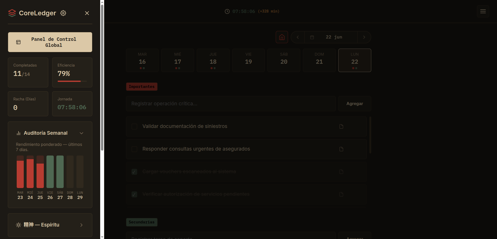
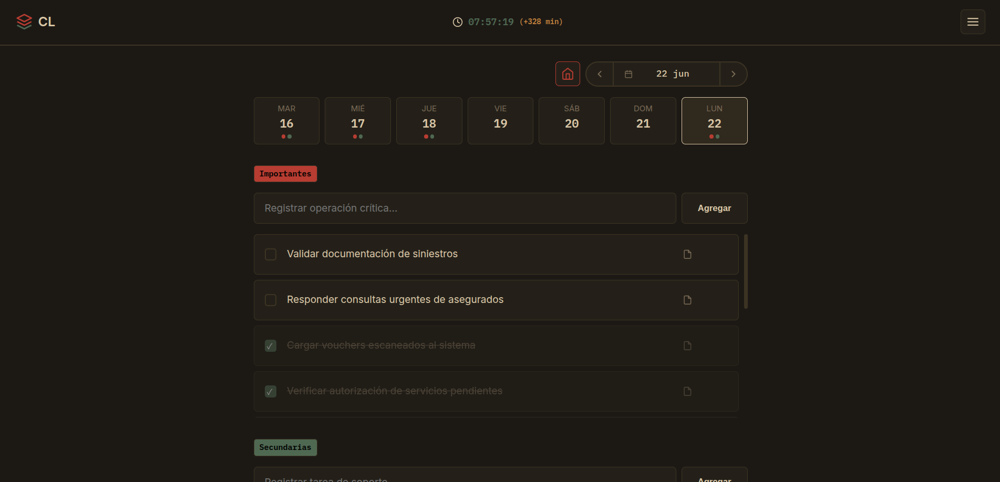
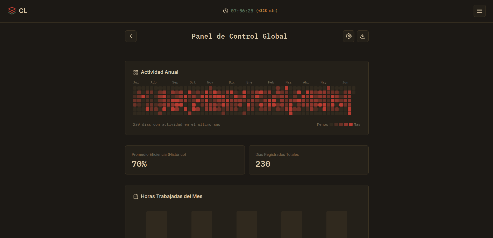

#

```text
 ██████╗ ██████╗ ██████╗ ███████╗██╗     ███████╗██████╗  ██████╗ ███████╗██████╗
██╔════╝██╔═══██╗██╔══██╗██╔════╝██║     ██╔════╝██╔══██╗██╔════╝ ██╔════╝██╔══██╗
██║     ██║   ██║██████╔╝█████╗  ██║     █████╗  ██║  ██║██║  ███╗█████╗  ██████╔╝
██║     ██║   ██║██╔══██╗██╔══╝  ██║     ██╔══╝  ██║  ██║██║   ██║██╔══╝  ██╔══██╗
╚██████╗╚██████╔╝██║  ██║███████╗███████╗███████╗██████╔╝╚██████╔╝███████╗██║  ██║
 ╚═════╝ ╚═════╝ ╚═╝  ╚═╝╚══════╝╚══════╝╚══════╝╚═════╝  ╚═════╝ ╚══════╝╚═╝  ╚═╝
```

<p align="center">

**Personal Productivity Dashboard**

*A lightweight productivity dashboard built to organize work, track performance and continuously improve daily workflow.*

</p>

---

<p align="center">


</p>

---

# Overview

CoreLedger is a lightweight productivity dashboard built to centralize everyday workflow into a single application.

The project started as a personal utility developed to improve my own daily work organization. Over time, it evolved into a complete operational dashboard capable of combining task management, productivity metrics, historical statistics and workflow analysis.

Rather than functioning as another traditional to-do list, CoreLedger aims to provide meaningful insights into how work is performed, allowing users to visualize progress, evaluate consistency and continuously improve their daily routines.

Every feature included in this repository was created to solve a real problem encountered during day-to-day work.

---

# Philosophy

CoreLedger follows a few simple principles.

* Organize before acting.
* Measure before optimizing.
* Simplicity over complexity.
* Everything should be immediately accessible.
* Offline First.
* Zero unnecessary dependencies.
* Fast, lightweight and maintainable.

The objective is not to become another generic productivity application.

The objective is to become an operational workspace.

---

# Current Features

## Productivity

* Daily task management
* Priority system
* Daily observations
* Historical task persistence
* Weekly planning

## Performance

* Productivity dashboard
* Weekly audit
* Daily efficiency metrics
* Historical statistics
* Completion percentage
* Productivity streaks

## Workflow

* Focus Timer
* Work session tracking
* Daily progress monitoring
* Session statistics

## Interface

* Multiple visual themes
* Dark Mode
* Light Mode
* Responsive Design
* Progressive Web App (PWA)

---

# Screenshots

## Dashboard

> *(coming soon)*



---

## Task Management

> *(coming soon)*



---

## Statistics

> *(coming soon)*



---

# Technology Stack

| Technology          | Purpose           |
| ------------------- | ----------------- |
| HTML5               | Structure         |
| CSS3                | User Interface    |
| Vanilla JavaScript  | Business Logic    |
| LocalStorage        | Local Persistence |
| Progressive Web App | Offline Support   |

---

# Roadmap

## Completed

* [x] Daily Tasks
* [x] Historical Storage
* [x] Weekly Dashboard
* [x] Productivity Metrics
* [x] Weekly Audit
* [x] Focus Timer
* [x] Theme System
* [x] PWA Support

---

## In Progress

* [ ] Calendar View
* [ ] Export Reports
* [ ] Search Engine
* [ ] Advanced Statistics
* [ ] Keyboard Shortcuts
* [ ] Better Mobile Experience

---

## Future

* [ ] Cloud Synchronization
* [ ] Multi-device Support
* [ ] Team Workspaces
* [ ] Plugin System
* [ ] API Integration

---

# Why CoreLedger?

Most productivity tools are designed for everyone.

CoreLedger was designed for real operational work.

Every screen, every metric and every interaction exists because it solved an actual problem during daily workflows.

This repository also represents my continuous learning journey as a software developer, where every new version introduces cleaner architecture, better user experience and improved maintainability.

---

# Installation

Clone the repository

```bash
git clone https://github.com/Naojr/coreledger.git
```

Open

```text
index.html
```

or deploy it using GitHub Pages.

---

# Project Structure

```text
CoreLedger/
│
├── index.html
├── manifest.json
├── sw.js
├── README.md
├── LICENSE
├── CHANGELOG.md
│
├── docs/
│   ├── banner.png
│   ├── dashboard.png
│   ├── tasks.png
│   └── statistics.png
│
├── assets/
├── css/
└── js/
```

---

# Development

Current architecture:

* ✔ Vanilla JavaScript
* ✔ HTML5
* ✔ CSS3
* ✔ Local Storage
* ✔ Responsive Layout
* ✔ Progressive Web App

Future versions may modularize the codebase while maintaining the same lightweight philosophy.

---

# Author

Developed by

**Joan Retamozo**

Argentina 🇦🇷

---

# License

MIT License

Feel free to fork, learn, improve and build upon this project.

---

<p align="center">

### **Organize your work.**

### **Measure your progress.**

### **Improve every day.**

</p>

---

<p align="center">

Made with ☕, curiosity and many hours of debugging.

</p>
